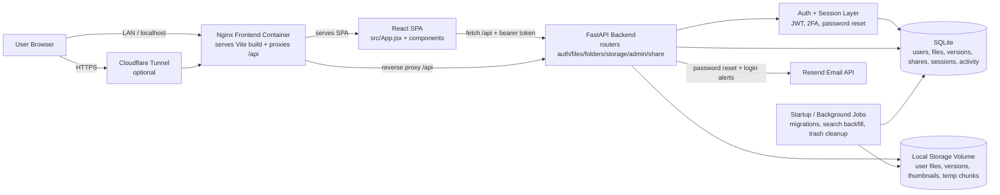

# Home Cloud Drive

A self-hosted personal cloud storage app with a modern React frontend and a FastAPI backend.

Home Cloud Drive lets you upload, organize, preview, share, and manage files with authentication, quotas, activity tracking, and admin controls.

## Table of contents

- [Features](#features)
- [Architecture](#architecture)
- [Tech stack](#tech-stack)
- [Repository layout](#repository-layout)
- [Quick start (Docker)](#quick-start-docker)
- [Local development](#local-development)
- [Configuration](#configuration)
- [API overview](#api-overview)
- [Security notes](#security-notes)
- [Useful commands](#useful-commands)
- [Additional documentation](#additional-documentation)

## Features

- JWT authentication (register/login/current-user) with Password Reset Flow
- Authenticator-based Two-Factor Authentication (2FA)
- Active Device & Session Management (view and revoke sessions)
- Optional new-login alert emails for tracked sessions
- Resumable chunked file uploads & folder uploads with real-time UI progress
- File version history with upload, download, restore, and delete actions
- Server-backed file search with background auto-indexing
- Drag-and-drop organization inside a detailed folder hierarchy
- HTTP Range Request streaming for seamless Video, Audio, & PDF inline preview
- Rename/move/copy/trash/restore/permanent delete flows
- Favorites (starred files)
- Image thumbnails generated server-side
- Secure sharing links (password, expiry, download limits)
- Storage usage reporting + activity logs
- Version-aware storage accounting in the dashboard
- Admin panel for user and quota management

## Architecture

This repository contains a full-stack personal cloud stack with a browser SPA, a FastAPI API, SQLite metadata storage, and local-disk file storage.

The full architecture diagram and subsystem breakdown live in [`docs/architecture.md`](docs/architecture.md).



## Tech stack

### Frontend

- React 18
- Vite 6
- Lucide React
- Nginx (production)

### Backend

- FastAPI
- SQLAlchemy (async)
- SQLite (`aiosqlite`)
- `python-jose` (JWT)
- `passlib` + `bcrypt` (password hashing)
- Pillow (thumbnails)
- SlowAPI (rate limiting)

## Repository layout

```text
.
|-- src/                      # Frontend source
|   |-- components/           # Auth/files/sharing/admin UI components
|   |-- App.jsx               # Main application shell
|   `-- api.js                # Frontend API client
|-- backend/
|   |-- app/
|   |   |-- main.py           # FastAPI app entry + startup tasks
|   |   |-- models.py         # SQLAlchemy models
|   |   |-- schemas.py        # Pydantic schemas
|   |   |-- auth.py           # Authentication helpers
|   |   |-- storage.py        # Local storage service
|   |   |-- thumbnails.py     # Thumbnail generation
|   |   `-- routers/          # Route modules
|   |-- requirements.txt
|   `-- Dockerfile
|-- docker-compose.yml        # Full deployment stack
|-- Dockerfile                # Frontend image build
|-- nginx.conf                # Frontend server config
`-- .env.example              # Environment template
```

## Quick start (Docker)

### Prerequisites

- Docker + Docker Compose
- Writable host paths for storage and database files

### 1) Configure environment

```bash
cp .env.example .env
```

Set at least these values in `.env`:

- `SECRET_KEY` (strong random key)
- `STORAGE_PATH` (host path for uploaded files)
- `DATA_PATH` (host path for SQLite data)

`SECRET_KEY` must be a real non-placeholder value at least 32 characters long.
The backend rejects placeholder-style values such as `CHANGE_ME`, `changeme`, or other obvious defaults during startup.

### 2) Build and start

```bash
docker-compose up -d --build
```

### 3) Access the app

- Frontend: `http://localhost:3001`

> The backend API is intentionally not published directly by default in `docker-compose.yml`.
> The backend `/health` endpoint is only reachable from inside the backend container or from loopback on the host that runs the API.

## Local development

### Backend

```bash
cd backend
python -m venv venv
source venv/bin/activate   # Linux/macOS
# .\venv\Scripts\activate  # Windows
pip install -r requirements.txt
cp .env.example .env       # Linux/macOS
# copy .env.example .env   # Windows
uvicorn app.main:app --reload --port 8000
```

Backend URL: `http://localhost:8000`

### Frontend

From repository root:

```bash
npm install
npm run dev
```

Frontend URL (default): `http://localhost:5173`

For local frontend development, make sure the backend allows your frontend origin.
If you keep the backend defaults, `http://localhost:5173`, `http://localhost:3000`, and `http://localhost` are already allowed.
If you override `CORS_ORIGINS`, include every frontend origin you actively use, such as `http://localhost:5173` for Vite or `http://localhost:3001` for the Docker-served UI.

## Configuration

Primary variables (root `.env`):

- `SECRET_KEY` - JWT signing key (required)
- `STORAGE_PATH` - host path for uploaded files
- `DATA_PATH` - host path for SQLite data
- `MAX_STORAGE_BYTES` - per-user quota (`0` = unlimited)
- `MAX_FILE_SIZE_BYTES` - maximum size allowed for a single uploaded/restored file (`0` = unlimited)
- `TRASH_AUTO_DELETE_DAYS` - days to keep trashed items before startup cleanup permanently deletes them (`0` disables cleanup)
- `ACCESS_TOKEN_EXPIRE_MINUTES` - token lifetime
- `TWO_FACTOR_TEMP_TOKEN_EXPIRE_MINUTES` - lifetime of temporary 2FA login challenge tokens
- `PASSWORD_RESET_EXPIRE_MINUTES` - password reset token lifetime in minutes
- `CORS_ORIGINS` - comma-separated allowed origins
- `ALLOW_REGISTRATION` - `true` to allow public signups
- `SESSION_LAST_SEEN_UPDATE_INTERVAL_SECONDS` - throttle for session activity writes
- `TRUST_PROXY_HEADERS` - trust forwarded proxy headers for client IP detection
- `RESEND_API_KEY` - Resend API key used to send transactional emails
- `RESEND_FROM_EMAIL` / `RESEND_FROM_NAME` - sender details shown on password reset and login alert emails
- `RESEND_API_URL` - Resend send-email endpoint, defaults to `https://api.resend.com/emails`
- `RESEND_TIMEOUT_SECONDS` - timeout for Resend API requests
- `PASSWORD_RESET_URL` - public frontend reset page URL used in emailed reset links
- `TUNNEL_TOKEN` - required only if using tunnel service

For production deployments, set `PASSWORD_RESET_URL` to your public frontend reset page so emailed links always use the correct host.
Use the full frontend reset route, for example `https://cloud.example.com/reset-password`, because the backend appends the `reset_token` query parameter automatically.
If `PASSWORD_RESET_URL` is omitted, the backend falls back to a trusted origin from `CORS_ORIGINS` when it can build a safe reset link.
If you deploy with the root [`docker-compose.yml`](./docker-compose.yml), the root `.env` is also where container-level overrides such as `MAX_FILE_SIZE_BYTES` and `TRASH_AUTO_DELETE_DAYS` should be set.
The Docker deployment passes `CORS_ORIGINS` into the backend as `CORS_ORIGINS_STR`, so the root `.env` remains the single place to manage allowed frontend origins for Compose-based deployments.

See `backend/.env.example` for backend-specific defaults.

### Password reset flow

- `POST /api/auth/forgot-password` sends a reset email through Resend when `RESEND_API_KEY` and `RESEND_FROM_EMAIL` are configured.
- The frontend handles reset links on `/reset-password?reset_token=...` and shows a dedicated password reset form.
- If email delivery is not configured, the API returns a clear setup error instead of silently failing.
- The same Resend configuration also enables new-login alert emails for tracked sessions.

### Sharing and upload notes

- Share links are file-only; folders cannot be shared directly.
- Trashing a file automatically deactivates any active share links that point to it.
- Password-protected share downloads use the `X-Share-Password` header instead of query parameters.
- Resumable uploads are stored under `storage/tmp/<user_id>/<upload_id>` until completion.
- Abandoned resumable upload temp directories are not automatically garbage-collected yet, so operators should monitor `storage/tmp` on long-running deployments.

## API overview

Main groups under `/api`:

- `/api/auth` - authentication
- `/api/files` - file operations, upload/download, thumbnails, trash
- `/api/folders` - folder operations
- `/api/storage` - storage stats, activity, trash cleanup
- `/api/admin` - admin-only user/system endpoints
- `/api/share` - share link create/access/revoke

Notable auth routes include login, register, forgot/reset password, 2FA setup and verification, and active session management.
Notable file routes also include version history endpoints for listing, uploading, restoring, downloading, and deleting historical versions of a file.

## File version history

- Every newly uploaded file starts at version `v1`.
- Non-folder files expose version history from the file details panel and context menu.
- Restoring an older version creates a new latest version rather than mutating history in place.
- Historical versions count toward storage usage and appear as a `versions` bucket in `/api/storage`.
- Existing databases are backfilled lazily: the backend creates base version records for legacy files the first time version history is accessed.

## Runtime behavior

- The backend runs lightweight SQLite migrations on startup for supported schema additions such as file version metadata.
- Search indexing for older files is backfilled in the background after startup.
- Trashed files older than `TRASH_AUTO_DELETE_DAYS` are permanently deleted during backend startup.
- The FastAPI OpenAPI/docs endpoints are disabled in the shipped backend app configuration.
- The health endpoint at `/health` is intentionally loopback-only and is mainly used by the Docker health check.

## Security notes

- Use a strong unique `SECRET_KEY` in production.
- Restrict `CORS_ORIGINS` to trusted origins.
- Keep `STORAGE_PATH` and `DATA_PATH` on durable volumes.
- Keep `ALLOW_REGISTRATION=false` unless public sign-up is intended.
- If using Cloudflare Tunnel, keep `TUNNEL_TOKEN` secret.

## Useful commands

```bash
# Frontend production build
npm run build

# Start services

docker-compose up -d --build

# Stop services

docker-compose down
```

## Additional documentation

- Backend service docs: [`backend/README.md`](backend/README.md)
- Architecture deep dive: [`docs/architecture.md`](docs/architecture.md)
- Development history: [`CHANGELOG.md`](CHANGELOG.md)
