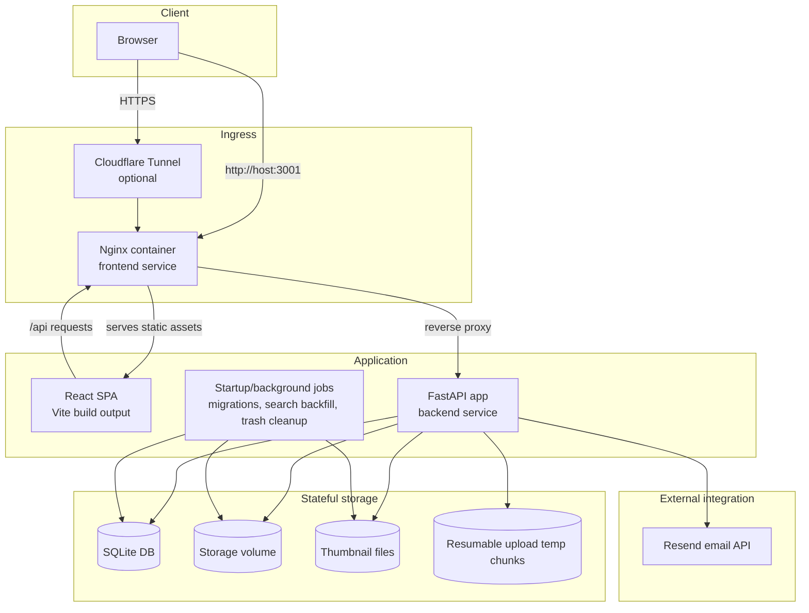
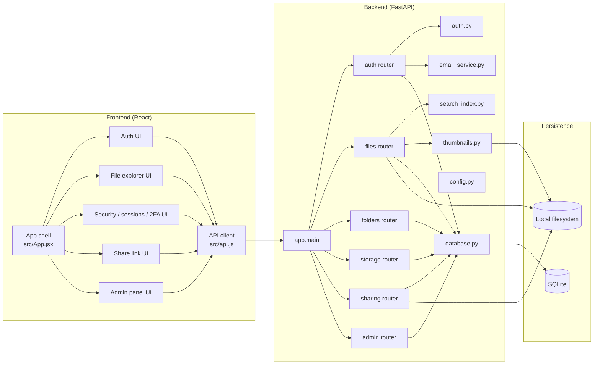
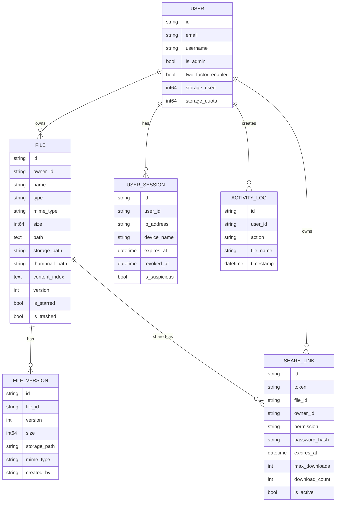

# Architecture

This document summarizes the actual runtime architecture implemented in the repository.
It is based on the code in `src/`, `backend/app/`, `docker-compose.yml`, and `nginx.conf`.

## 1. Deployment architecture

## 2. Logical application architecture

## 3. Major backend responsibilities

- `app.main`: bootstraps FastAPI, CORS, rate limiting, router registration, startup/shutdown lifecycle, loopback-only `/health`.
- `app.auth`: password hashing, JWT access tokens, temporary 2FA tokens, password reset tokens, current-user/session validation, admin guard.
- `app.routers.auth`: registration, login, 2FA setup/enable/disable, session listing/revocation, logout, password change, forgot/reset password.
- `app.routers.files`: directory listing, search, streamed upload, resumable chunk upload, download, preview, thumbnail serving, rename/move/star, trash/restore, permanent delete, copy, version history.
- `app.routers.folders`: create folder and recursive trashing for folder delete.
- `app.routers.storage`: per-user quota/storage breakdown, activity log, empty trash.
- `app.routers.sharing`: create/list/revoke share links, public metadata access, public download with password/expiry/download-limit checks.
- `app.routers.admin`: user management, quota updates, admin promotion, forced password reset, delete user, system stats.

## 4. Data model

## 5. Key runtime flows

### Authentication and session management

1. React auth screens call `src/api.js`.
2. `POST /api/auth/login` validates the user.
3. If 2FA is enabled, the backend returns a temporary token.
4. `POST /api/auth/login/2fa` exchanges that temporary token plus TOTP code for a JWT.
5. The backend also creates a `user_sessions` row and binds the JWT `sid` claim to it.
6. Authenticated requests use `Authorization: Bearer <token>`.

### File upload and organization

1. The SPA uploads through `src/api.js`.
2. Small/streamed uploads go to `/api/files/upload`.
3. Resumable uploads use:
   - `/api/files/upload/init`
   - `/api/files/upload/{upload_id}/chunk`
   - `/api/files/upload/complete`
4. Chunks are stored in a temp folder under the storage volume.
5. Completed files are written to the user's storage directory.
6. Metadata is stored in SQLite and an activity log entry is recorded.
7. Image uploads may trigger thumbnail generation.
8. Text-like files may be indexed for search.

### Search

1. The frontend calls `/api/files/search?q=...`.
2. The backend searches file name, path, mime type, type, and `content_index`.
3. `search_index.py` extracts searchable text for text-like files.
4. Startup backfill fills missing `content_index` values for older files.

### Sharing

1. An authenticated user creates a `share_links` record from the Share modal.
2. Public consumers hit `/api/share/{token}` to inspect the share.
3. Public downloads use `/api/share/{token}/download`.
4. The backend enforces password, expiry, active-state, and download-count rules before serving the file.

### Password reset and alerts

1. `POST /api/auth/forgot-password` creates a signed reset token.
2. The backend constructs a frontend reset URL.
3. Email delivery goes through the Resend API.
4. The frontend handles `/reset-password?reset_token=...`.
5. Login alert emails are also sent for tracked sessions when email delivery is configured.

## 6. Startup and maintenance behavior

- On startup, the backend creates missing directories and initializes the database schema.
- `run_migrations()` adds supported columns/indexes for older SQLite databases.
- `cleanup_old_trash()` permanently deletes files older than `TRASH_AUTO_DELETE_DAYS`.
- `backfill_search_index()` runs in the background after startup and indexes legacy files.
- On shutdown, any running search-backfill task is cancelled cleanly.

## 7. Deployment notes that affect architecture

- The browser usually talks only to the frontend container.
- Nginx serves the built React app and proxies `/api` to the backend container.
- In Docker Compose, the backend is intentionally not published directly to the public host network.
- The frontend is exposed on host port `3001`.
- Cloudflare Tunnel is optional and routes external traffic to the frontend service.
- Persistent state lives in two bind-backed Docker volumes:
  - file storage volume
  - SQLite data volume

## 8. If you want to redraw this elsewhere

These are the minimum boxes and links you should keep:

- Browser
- Optional Cloudflare Tunnel / reverse-proxy ingress
- Nginx frontend container
- React SPA
- FastAPI backend
- Auth/session service
- SQLite metadata store
- Local filesystem storage
- Background maintenance jobs
- Resend email API

Critical relationships:

- SPA calls backend over `/api`
- Backend persists metadata in SQLite
- Backend stores binary files, thumbnails, and upload chunks on disk
- Backend sends transactional email through Resend
- Share links allow public access without normal JWT auth
- Startup jobs mutate both DB state and filesystem state
